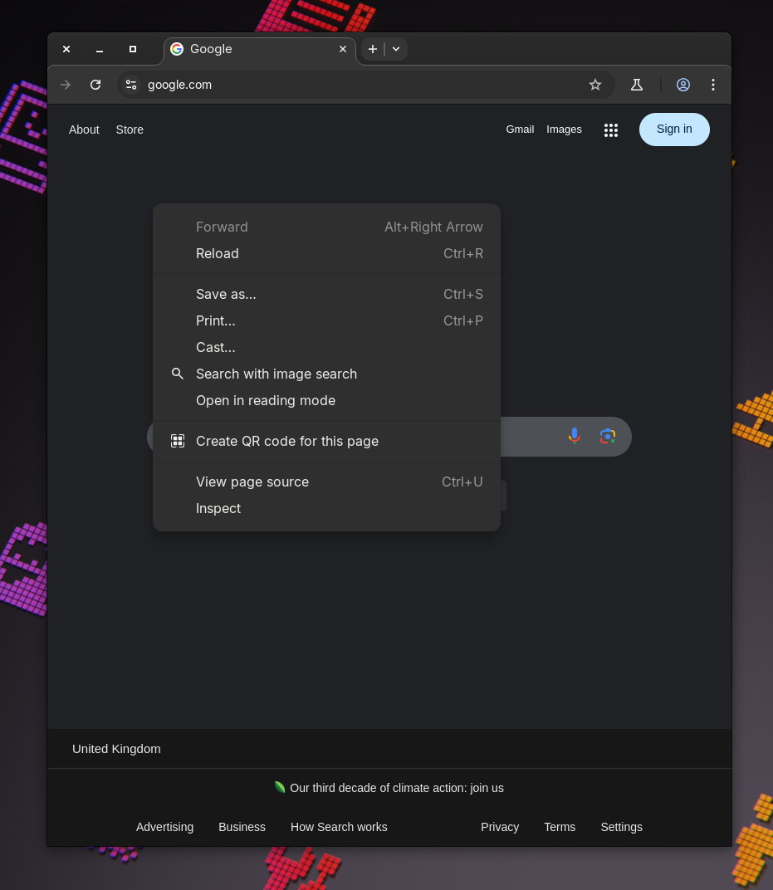

# No Going Back Patch for Chrome/Chromium

## Description
This patch ensures that users cannot navigate back in Chrome/Chromium browsers. Once applied, there is **no going back**—literally.

<p align="center"></p>

## Installation Instructions
To apply the patch, navigate to the Chromium source directory and run:

```sh
patch -p1 < chromium_no_going_back.diff
```

## Building Chromium from Source on Linux
To build Chromium from source, follow these steps:

1. Install dependencies:
   ```sh
   sudo apt update && sudo apt install build-essential python3 git
   ```
2. Fetch the depot tools:
   ```sh
   git clone https://chromium.googlesource.com/chromium/tools/depot_tools.git
   export PATH="$(pwd)/depot_tools:$PATH"
   ```
3. Fetch the Chromium source:
   ```sh
   fetch --nohooks chromium
   cd src
   ```
4. Install additional dependencies:
   ```sh
   ./build/install-build-deps.sh
   ```
5. Apply the patch:
  ```sh
  patch -p1 < chromium_no_going_back.diff
  ```
6. Run hooks and generate build files:
   ```sh
   gclient sync
   gn gen out/Default
   ```
7. Build Chromium:
   ```sh
   autoninja -C out/Default chrome
   ```

## Disclaimer
Use this patch with caution. Once applied, there is **no going back**.

